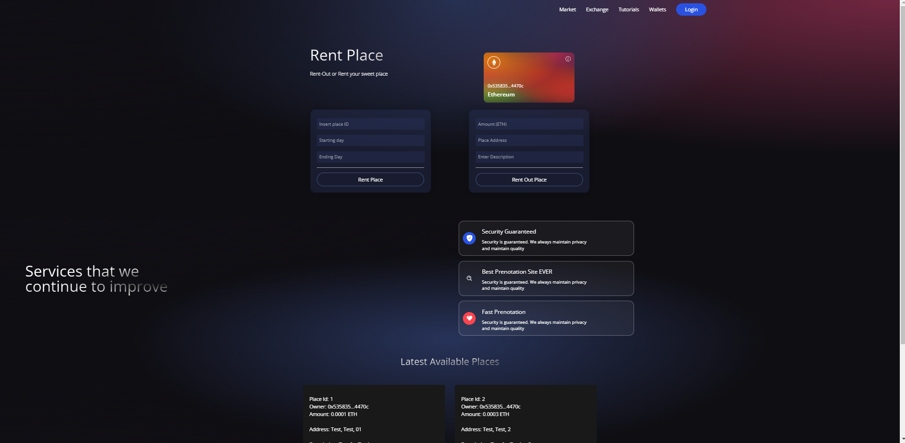

# Blockchain-Project

Contains a decentralized Web-App that allows users to Rent or Rent Out a Place by giving some informations:
- Renting phase: In this case it is required to fill 3 camps respectively: Place ID, Starting Day of the rent and Ending Day;
- Renting Out phase: In this other case it is required to fill: Price per day (ETH), Place address and Place Description.

It is also possible to **set as inactive** a place but only if connected with the address that preventively added a Place as available for renting.

## Back-End Technology
- Solidity
- HardHat

## Front-End Technology
- React
- Ethers
- Tailwind (for styiling)

# Web-Dapp Preview

# How to setup an environment like the project one
1. Install node.js (https://nodejs.org/en/)
2. Create two folders: Smart Contract and client
3. cd client
4. Inside terminal > npm init vite@latest > follow instruction
5. Inside terminal > npm install
6. Inside terminal > npm run dev (to see if all has been installed correctly

## For styling 
Follow (https://tailwindcss.com/docs/guides/create-react-app) instructions
1. Cd client
2. npm install react-icons

## To create basic smart-contract structure
1. cd smart-contract
2. npm install --save-dev hardhat @nomiclabs/hardhat-waffle ethereum-waffle chai @nomiclabs/hardhat-ethers ethers
3. npx hardhat

## Run the webpage
1. cd client
2. npm run dev

# Author
[Marco Cucè](https://github.com/Marco97-exe)
